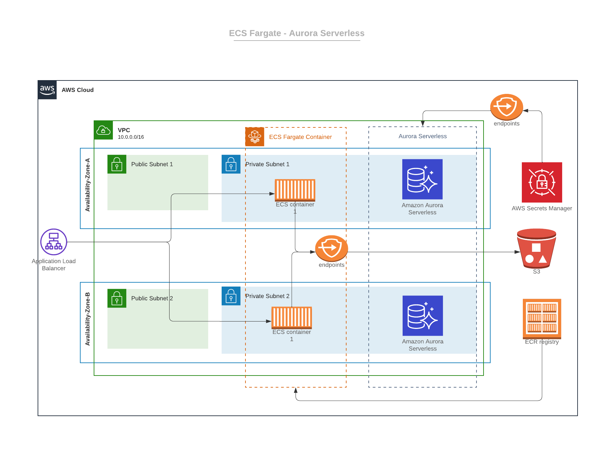

# Django ECS Application Demo



The `cdk.json` file tells the CDK Toolkit how to execute your app.

This project is set up like a standard Python project.  The initialization
process also creates a virtualenv within this project, stored under the `.venv`
directory.  To create the virtualenv it assumes that there is a `python3`
(or `python` for Windows) executable in your path with access to the `venv`
package. If for any reason the automatic creation of the virtualenv fails,
you can create the virtualenv manually.

To manually create a virtualenv on MacOS and Linux:

```bash
python3 -m venv .venv
```

After the init process completes and the virtualenv is created, you can use the following
step to activate your virtualenv.

```bash
source .venv/bin/activate
```

If you are a Windows platform, you would activate the virtualenv like this:

```bash
.venv\Scripts\activate.bat
```

Once the virtualenv is activated, you can install the required dependencies.

``` bash
pip install -r requirements.txt
```

At this point you can now synthesize & deploy the CloudFormation template for this code.

``` bash
cdk deploy --all
```
